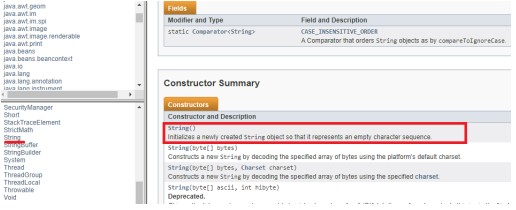

# Les classes Math, String i Scanner

Tot programa Java ha d'estar compost per almenys una classe.

Les classes a Java poden ser de dos tipus: classes pròpies (són les que creem nosaltres) i classes definides (String, Math, Array, Thread, etc.).

Hi ha centenars de classes i cadascuna amb una gran diversitat de mètodes. És tan àmplia la xifra que no es poden saber totes de memòria i encara menys la seva sintaxi. És per això que a Java existeix el que s'anomena Biblioteca de Classes o API de Java, que no és ni més ni menys que una biblioteca on vénen relacionades totes les classes de Java i els seus mètodes.

Amb freqüència accedirem a aquesta biblioteca per fer consultes. Per això realitzarem una cerca des de qualsevol navegador amb el text “Java API”. Que ens portarà al següent enllaç.

https://docs.oracle.com/javase/8/docs/api/


Al panell inferior esquerre podrem veure totes les classes existents a Java que analitzarem com consultar-ho més endavant.

## La classe Math

Centrant-nos en la classe Math veurem alguns mètodes de gran utilitat.

- **Math.round**(decimal): arrodoniment d'un número
- **Math.sqrt**(n): arrel quadrada
- **Math.pow**(base, exponent): calcula la potència d'un nombre base elevat a un exponent
- **Math.sin**(angle): si d'un angle (igual que la resta de funcions trigonomètriques)

També hi ha les constants de classe.

**Math.PI**: número PI

A la part superior esquerra de la imatge veiem que apareix el concepte de Paquets.

Hem de tenir en compte que les classes sempre estan contingudes en un paquet, és a dir, que cada paquet conté un conjunt classes. Això no és ni més ni menys que una manera d'ordenació de les classes.

A més, els paquets també tenen una certa jerarquia (com passa amb les carpetes del nostre ordinador). Uns paquets poden contenir altres. Així, per exemple, podem veure aquesta jerarquia

- **java.lang**
- **java.lang.annotation**
- **java.lang.instrument**
- **java.lang.invoke**
- **java.lang.management**
- **java.lang.ref**
- **java.lang.reflect**

on el paquet **java.lang.annotation** i tots els següents estan continguts al paquet 
principal **java.lang**.

Addicionalment, hem de tenir en compte que el paquet **java.lang** és el paquet per defecte de Java, de manera que totes les funcions que veurem a continuació es poden utilitzar sense haver de fer cap menció explícita a aquest paquet.Tot el que veurem a continuació ho podem fer creant-nos una classe **Prova**.

Una vegada al cos del mètode principal començarem a teclejar la següent instrucció:

`***int arrel=Math.***`

En el moment en què teclegem el **punt** `.`. veiem que apareix una finestra d'ajuda com la següent que ens indica els mètodes i constants que podem utilitzar dins de la classe **Math**.


Si continuem teclejant la paraula “sq” veurem que a mesura que escrivim cada lletra l'ajuda es va concretant fins arribar finalment al mètode que ens interessa que és “sqrt” o arrel quadrada.


Un altre aspecte molt important d'aquesta ajuda és que ja ens indica tant el tipus de dada en què els paràmetres han d'estar definits (en l'exemple indica que un hipotètic nom de paràmetre “a” ha d'estar definit com a **double**), així com el tipus de dada en què ha d'estar definida la variable destinació (en el nostre cas la variable “arrel” hauria d'haver estat definida com a **double** i no com a **int**, però vegem que passa si cometem aquest error).

Tornem a l'editor i continuem completant la nostra instrucció. Veurem com l'editor mostra que hem comès un error.


Primer ens marca a l'inici de la línia un avís. Si posem el punter a sobre sense fer clic ens indicarà que els tipus de dades són incompatibles. Si fem clic sobre l'avís veurem les propostes de solució que ens ofereix. La segona solució ens proposa que definim correctament el tipus de dades per a la variable arrel.


La primera solució ens proposa que, si volem mantenir la variable `arrel` com a sencera apliquem una conversió de tipus (refosa o cast, que explicarem més endavant) sobre la classe, cosa que donarà com a resultat la següent instrucció.

`int arrel=(int) Math.sqrt(25);`

Si fem clic sobre qualsevol de les solucions veurem com l'editor realitza automàticament els canvis.

Ara passem a treballar amb el mètode **round** de la classe **Math**. Per això, primer declararem la variable `numero1`.

`float numero1=7.5793F;`

Ara començarem a escriure la instrucció per a l’arrodoniment fins que ens aparegui 
l'ajuda:

`int resultat1=Math.ro`


Com veiem la classe **Math** té dos mètodes round: un que arrodoneix una variable **float** i la deixa en una sencera, i un altre que arrodoneix una variable **double** la deixa en una de tipus **long**.

Completarem les instruccions per al primer cas i després les repetirem per utilitzar el segon cas sobre les variables `numero2` (amb valor 7.493) i `resultat2`.

Addicionalment, es poden incloure més instruccions amb diversos tipus de dades i diversos valors decimals (p.e. intercanviant els valors de numero1 i numero2) per a veure els resultats.

Finalment passarem a treballar amb el mètode d'elevar a un exponent. Per això, ens crearem una variable per a la base i una altra per a l'exponent.

`double base=10;`

`double exponent=5;`

Realitzarem el càlcul d'exponent sobre una variable `resultat3`. Seguirem els mateixos passos que abans perquè ens aparegui l'ajuda d'autocompletar.

`int resultat3=Math.pow`

I acabarem completant la instrucció amb els paràmetres `base` i `exponent`.

El nostre programa complet serà:

::: details Codi

```java
public class UF04ExempleClasseMath {
    public static void main(String[] args) {

        // Càlculs amb el mètode d’ arrel quadrada
        int arrel=(int) Math.sqrt(25);
        double arrelD= Math.sqrt(25);
        System.out.println(arrel);
        System.out.println(arrelD);

        // Càlculs amb el mètode d’arrodoniment
        float numero1=7.579F;
        int resultat1=Math.round(numero1);
        double numero2=7.4793;
        long resultat2=Math.round(numero2);
        System.out.println(resultat1);
        System.out.println(resultat2);

        // Càlculs amb el mètode d’elevar a un exponent
        double base=10;
        double exponent=5;
        double resultat3=Math.pow(base,exponent);
        System.out.println(resultat3);
    }
}

```

:::

## La classe String

Com ja hem comentat, per a la gestió de les dades de tipus caràcter a Java no hi ha un tipus de dades primitiu, sinó que això es realitza a través de la classe **String**.

Per a la definició de variables ho farem com ho fèiem amb els tipus de dades primitives.

`String text=”Primer text”`

En aquest cas, text és una variable objecte o instància de la classe **String**.

String, com a classe que és, té els seus mètodes. Així, el mètode **lenght()** ens permet saber la longitud d’una cadena de caràcters, **charAt()** ens permet saber la posició d’un caràcter en una cadena, o **substring()** permet extreure una subcadena d’una cadena a partir d’una posició i un nombre de caràcters a extreure o **equals()** ens diu si dues cadenes són iguals o no.

::: info Nota:
Cal tenir en compte que la primera posició d'una cadena no és la 1 sinó la 0.
:::

Els mètodes d’aquesta classe no estan declarats com a **estàtics**. És per això que per a utilitzar-los necessitarem **instanciar una variable de tipus String** mitjançant un **constructor**.

Un constructor ens permetrà instanciar els objectes que utilitzarem d'aquesta classe i té el mateix nom que la classe. Ens podem trobar amb classes que tenen diversos constructors amb el mateix nom, però diferents paràmetres, és a dir, que són per a diferents usos. De moment, ens quedarem amb aquesta idea i ja l'aprofundirem més endavant. En el nostre cas farem servir el primer constructor.



>***Exemple de la classe String.***
>
>::: details Codi
>
>```java
>public class UF04ExempleClasseString {
>    public static void main(String[] args) {
>        
>        String descartes="Pense, aleshores existisc";
>        System.out.println("Descartes diu: " + descartes);
>        System.out.println("El que diu Descartes té una longitud de " + descartes.length() + " lletres");
>        System.out.println("El que diu Descartes comença per la lletra " + descartes.charAt(0));
>        int ultimaLletra=descartes.length();
>        System.out.println("L’última lletra es " + descartes.charAt(ultimaLletra-1));
>        System.out.println(descartes.substring(0, 16));
>    }
>}
>```
>
>:::

## La classe Scanner

Com havíem esmentat prèviament tots els mètodes de la classe Math i els mètodes de la classe String els hem pogut fer servir perquè pertanyen al paquet java.lang.

Però que passa si volem fer servir la classe Scanner. Aquesta classe no pertany al paquet per defecte java.lang, de manera que em donarà un error. Per tant, aquí sí que haurem de citar explícitament que volem fer servir un paquet.


Veiem que l'error m'està indicant que cal importar el paquet **java.util** per poder utilitzar aquesta classe. Per tant, la primera instrucció que introduirem a la nostra classe és:

`import java.util.*;`

La classe Scanner té una sèrie de mètodes que no són **estàtics** com **nextLine()** per introduir text, **nextInt()** per introduir nombres enters o **nextDouble()** per a nombres decimals. Això implica que per fer-los servir no és a través d'instància de la classe, sinó que implica la creació d'un objecte de la classe **Scanner** o, el que és el mateix, que la instanciem. Igualment, el mètode **hasNextInt()** i similars els podrem fer servir per verificar el tipus de dada introduïda per teclat.

Encara que això es veurà detalladament més endavant, per veure quin paquet hem d'importar podem consultar-lo per internet a la web Java API i buscarem la classe **Scanner**. Al principi veurem que ens indica quin paquet es troba, i per tant, aquest serà el que hem d'importar.


Igualment, si avancem a la pàgina més endavant ens indica quins són els constructors de la classe que ja em explicat que serveixen per a instanciar els objectes o variables que utilitzarem en aquesta classe.


Igualment, a la pàgina més endavant apareix la llista de mètodes d’aquesta classe.


Entre aquests mètodes trobarem els tres mètodes esmentats i com en veiem cap és **static**, la qual cosa implicarà que abans d'utilitzar-los haurem d'haver creat un objecte (o instanciat la classe).


Fent clic sobre aquests accedirem a la informació ampliada on comprovarem que no són estàtics.


Ara completarem el codi de la classe tal com s'indica a continuació.

Com veiem, primer instància la classe Scanner creant l’objecte “entrada” que utilitzarà a continuació per utilitzar els mètodes de la classe. Igualment, el resultat de la lectura s'emmagatzemarà en variables que cal definir amb el tipus de dades que corresponga.

>***Exemple:*** llegir text del teclat.
>::: details Codi
>
>```java
>public class UF04ExempleClasseScanner1 {
>    public static void main(String[] args) {
>
>        // Instanciem la classe Scanner per a realitzar les entrades
>        Scanner entrada = new Scanner(System.in);
>
>        // Sol·licitem la primera dada de tipus text a través de l'objecte Scanner creat
>        System.out.println("Introdueix el teu nom");
>        String nom=entrada.nextLine();
>
>        // Sol·licitem la segona dada de tipus text a través de l'objecte Scanner creat
>        System.out.println("Introdueix la teua edat");
>        int edat=entrada.nextInt();
>
>        // Mostrem els missatges d'eixida finals
>        System.out.println("Hola " + nom + ", tens " + edat + " anys.");
>        System.out.println("L'any que ve tindràs " + (edat+1) + " anys.");
>        entrada.close();
>    } 
>}
>```
>
>:::
>
>::: info Nota
>Què passa si en compte d'escriure (edat+1) escrivim el mateix sense els parèntesis? Realitza la prova.
>:::

Veiem un altre exemple.

>***Exemple:*** llegir un sencer del teclat i comprovar que és correcte.
>::: details Codi
>```java
>public class UF04ExempleClasseScanner2 {
> 
>    public static void main(String[] args) {
>        Scanner entrada = new Scanner(System.in);
>        int valor = 0;
>
>        System.out.print("Escriu un valor enter: ");
>        if (entrada.hasNextInt()) {
>            valor = entrada.nextInt();
>            System.out.println("El valor era " + valor + ".");
>        } else {
>            entrada.next();
>            System.out.print("El valor no era enter.");
>        }
>
>        entrada.nextLine();
>        entrada.close();
>    } 
>}
>```
>:::

El mètode de la classe Scanner vinculat a la lectura d’una cadena de text composta **d’una única paraula** és **next()**.

Recordeu que, si en una mateixa línia escrius més d'una paraula, successives invocacions a aquest mètode no bloquejaran el programa, sinó que aniran avaluant les successives dades pendents de llegir.

El mètode de la classe Scanner vinculat a la lectura d'una cadena de text en forma de frase on hi ha **diverses paraules separades per espais** és **nextLine()**.

