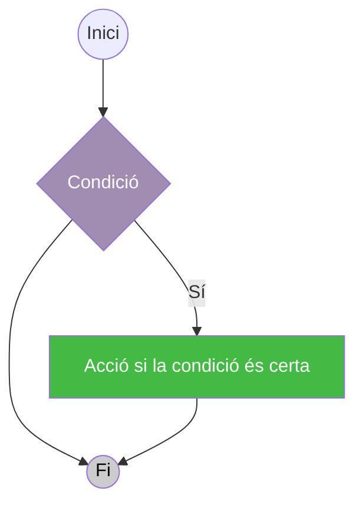
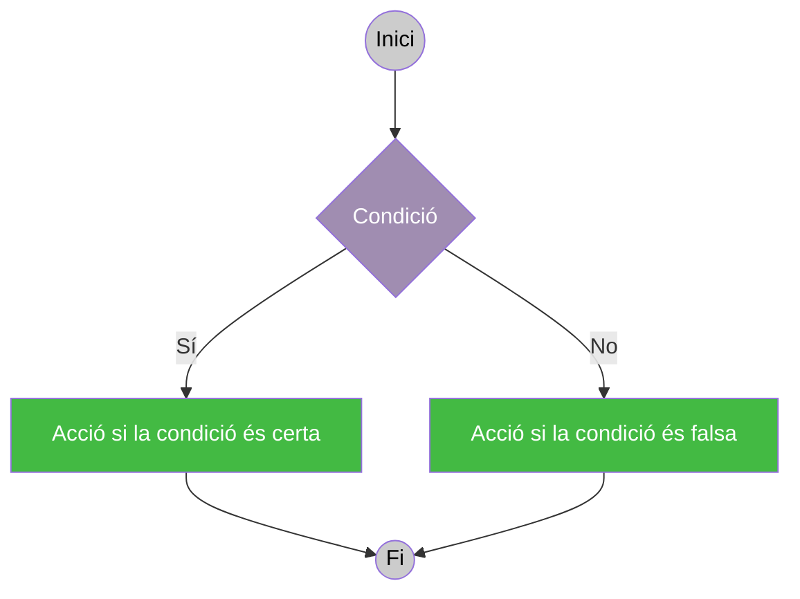
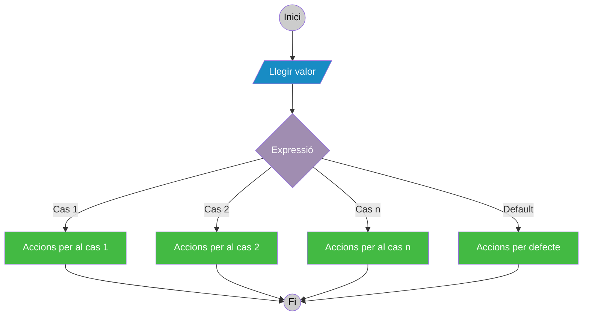

# 8. Estructures alternatives

Com ja vam veure, lEs estructures alternatives són construccions que permeten alterar el flux seqüencial d'un programa de manera que en funció d'una condició o el valor d'una expressió, el mateix puga ser desviat en l'una o l'altra alternativa de codi. Les estructures alternatives disponibles a Java són:

- Alternativa Simple (if)
- Alternativa Doble (if-else)
- Alternativa Múltiple (switch)

## 8.1. Estructura alternativa simple (if)

L'alternativa simple es codifica de la següent forma:



::: tabs
== Java

```java
if (condició){
    //Accions
}
```

El bloc d'Accions s'executa si la condició s'avalua a true (és vertadera).

```java
if (cont == 0){
    System.out.println("cont és 0");
    //més instruccions...
}
```

Si dins del if només hi ha una instrucció, no és necessari posar les claus.

```java
if (cont == 0) System.out.println("cont és 0");
```

:::

## 8.2. Estructura alternativa Doble (if-else)

L'alternativa doble permet indicar quin codi executar si la condició és falsa.



::: tabs
== Java

```java
if (condició){
    // AccionsSI
} else {
    // AccionsNO
}
```

El bloc AccionsSI s'executa si la condició s'avalua a true (vertadera). En cas contrari, s'executa el bloc de AccionsNO.

```java
if (cont == 0){
    System.out.println("cont és 0");
    // més instruccions...
} else {
    System.out.println("cont no és 0");
    // més instruccions...
}
```

Si dins del if només hi ha una instrucció, no és necessari posar les claus.

```java
if (cont == 0) System.out.println("cont és 0");
else System.out.println("cont no és 0");
```

:::

::: tip **IMPORTANT!**

Recordeu que l'operador relacional per a comprovar si són iguals és ==, no un sol = que correspon amb l'operador d'assignació. Aquest error no el detecta el compilador i és difícil d'esbrinar.

:::

En moltes ocasions, es s'encadenen estructures alternatives if-else, de manera que es pregunte per una condició si anteriorment no s'ha complit una altra successivament.  

>**Exemple:**  
>Suposem que realitzem un programa que mostra la nota d'un alumne en la forma (insuficient, suficient, bé, notable o excel·lent) en funció de la seua nota numèrica. Podria codificar-se de la següent forma:
>
>:::: tabs
>=== Java
>
>::: tabs
>== Codi
>
>```java
>import java.util.Scanner;
>
>public class Nota{
>
>   public static void main(String[] args){
>
>     Scanner entrada = new Scanner (System.in);
>     int nota;
>     //Suposem que l'usuari introdueix el número correctament
>     //No fem comprovacions
>     System.out.println ("Dona'm un número entre 0 i 10");
>     nota = entrada.nextInt();
>
>     if (nota < 5) {
>       System.out.println ("Insuficient");
>     } else if (nota < 6) {
>       System.out.println ("Suficient");
>     } else if (nota < 7) {
>       System.out.println ("Bé");
>     } else if (nota < 9) {
>       System.out.println ("Notable");
>     } else {
>       System.out.println ("Excel·lent");
>     }
>  }
>}
>
>```
>
>== Eixida
>
>```
>Dona'm un número entre 0 i 10
>8
>Notable
>```
>
>:::
>::::

És molt recomanable usar la tecla tabulador en les instruccions de cada bloc. Com es pot veure en l'exemple, cada **else** està alineat amb el seu **if** associat, d'aquesta manera és més fàcil llegir el codi.

## 8.3. Estructura Alternativa Múltiple (switch)



::: tabs
== Java

```java
switch (selector) {
    case valor1:
        // Accions per al cas 1
        break;
    case valor2:
        // Accions per al cas 2
        break;
    // ...
    default:
        // Accions per al defecte
}
```

En aquest `switch`, el valor del **selector** es compara amb cada etiqueta **'case'**. Quan coincideix amb un **valor**, s’executen les accions corresponents fins al `break`, que fa que el flux isca del `switch`. Si cap 'case' coincideix, s’executa el bloc **default**.

```java
switch (diaSetmana) {
    case "dilluns":
        System.out.println("Avui és dilluns");
        break;
    case "divendres":
        System.out.println("Avui és divendres");
        break;
    default:
        System.out.println("És un altre dia de la setmana");
}
```

En aquest exemple, segons el contingut de la variable `diaSetmana`, s’imprimeix un missatge diferent. El `break` impedeix que es continuï en els següents casos (fall-through).

:::

És molt important entendre que **en el switch s'avalua una expressió** (un valor concret com 0, 5, 1…) **no una condició** (vertadera o falsa) com en el if i el if-else.

El programa comprova el valor de l'expressió i saltarà al 'case' que corresponga amb aquest valor (valor1 o valor2 o …) executant el codi de dita 'case' (Accions per al cas 1, accions per al cas 2, etc.). Si no coincideix cap valor, saltarà al 'default' i executarà les accions per defecte.

És important afegir la sentència break; al final de cada 'case', ja que en cas contrari el programa continuarà executant el codi de les altres accions i normalment no voldrem que faça això (encara que Java permet fer-ho, és confús i per això està desaconsellat).

>**Exemple de l'estructura switch en codi:**  
>
>:::: tabs
>=== Java
>
>::: tabs
>== Codi
>
>```java
>import java.util.Scanner;
>
>public class Alternativa_Multiple{
>
>   public static void main(String[] args){
>
>     Scanner entrada = new Scanner (System.in);
>     int dia;
>
>     System.out.println ("Dona'm un número entre 1 i 7");
>     dia = entrada.nextInt();
>
>     switch (nota) {
>       case 1:
>         System.out.println ("Dilluns"); break;
>       case 2: 
>         System.out.println ("Dimarts"); break;
>       case 3:
>         System.out.println ("Dimecres"); break;
>       case 4:
>         System.out.println ("Dijous"); break;
>       case 5: 
>         System.out.println ("Divendres"); break;
>       case 6:
>         System.out.println ("Dissabte"); break;
>       case 7:
>         System.out.println ("Diumenge"); break;
>       default:
>         System.out.println("Error, el número ha d'estar entre 1 i 7");
>     }
>  }
>}
>```
>
>== Eixida
>
>```
>Dona'm un número entre 1 i 7
>4
>Dijous
>```
>
>:::
>::::
