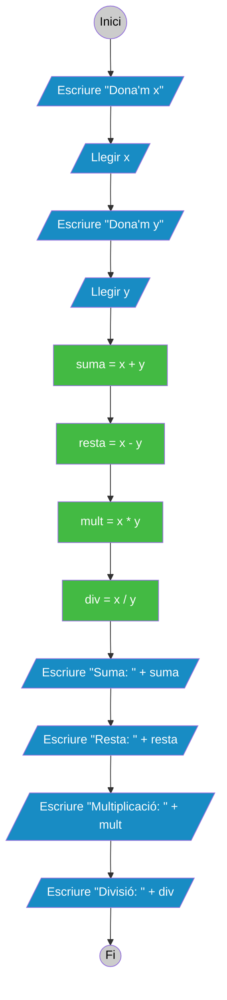
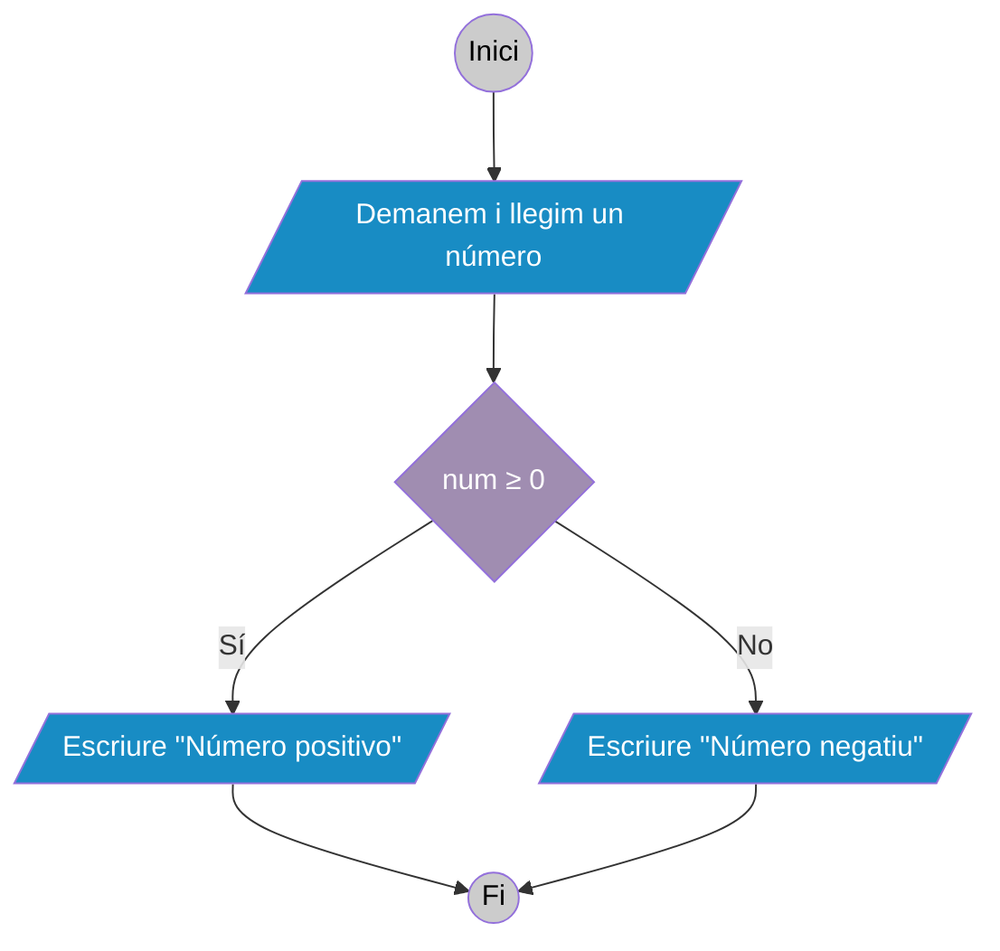

# 9. Exemples

## 9.1. Exemple 1

Programa que llig dos números, calcula i mostra el valor de les seues suma, resta, producte i divisió.



:::: tabs
=== Java

::: tabs
== Codi

```java
package exemple1;

import java.util.Scanner; // Importa la classe Scanner

public class Exemple1 {

    public static void main (String[] args){

        //Declarem les variables que anem a usar
        int x, y, suma, resta, mult, div;

        //Creem l'objecte Scanner per a llegir per teclat
        Scanner reader = new Scanner(System.in);

        //Demanem i llegim x
        System.out.print("Dona'm el valor de x: ");
        x = reader.nextInt();

        //Demanem i llegim y
        System.out.print("Dona'm el valor de y: ");
        y = reader.nextInt();

        //Relitzem els càlculs necessaris
        suma  = x + y;
        resta = x - y;
        mult  = x * y;
        div   = x / y;

        //Mostrem els resultats per pantalla
        System.out.println("Suma: " + suma);
        System.out.println("Resta: " + resta);
        System.out.println("Multiplicació: " + mult);
        System.out.println("Divisió: " + div);
    }    
}
```

== Eixida

```
Dona'm el valor de x: 4
Dona'm el valor de y: 2
Suma: 6
Resta: 2
Multiplicació: 8
Divisió: 2
```

:::
::::

## 9.2. Exemple 2

Programa que llig un número i em diu si és positiu o negatiu. Considerarem el zero com a positiu.



:::: tabs
=== Java

::: tabs
== Codi

```java
package exemple2;

import java.util.Scanner; // Importa la classe Scanner

public class Exemple2 {

    public static void main (String[] args){

        //Declarem la variable num
        int num;

        //Creem l'objecte Scanner per a llegir per teclat
        Scanner reader = new Scanner(System.in);

        //Demanem i llegim x
        System.out.print("Dona'm un número: ");
        num = reader.nextInt();

        //Estructura alternativa doble
        if (num >= 0)
          System.out.println("Número positivo");
        else
          System.out.println("Número negativo");
    }    
}
```

== Eixida

```
Dona'm un número: 10
Número positiu
```

:::
::::

## Més exemples

## Exemple 1

Realitza un programa que demane una hora per teclat i que mostre després bon dia, bona vesprada o bona nit segons l'hora. S'utilitzaran els trams de 6 a 12, de 13 a 20 i de 21 a 5 respectivament. Només es tenen en compte les hores, els minuts no s'han d'introduir per teclat.

::: tabs
== Java

```java
import java.util.Scanner;
/**
* UF04 Exemple 1: Programa que demana una hora per teclado i ens dona el
* bon dia, bona vesprada o bona nit segons l'hora.
*/
public class UF04Exemple01 {
    public static void main(String[] args) {
        int hora;
        Scanner entrada = new Scanner (System.in);
 
        System.out.print("Introdueix una hora del dia (de 0 a 23): ");
        hora = entrada.nextInt();

        if ((hora >= 6) && (hora <= 12)) {
           System.out.println("Bon dia");
        } else if ((hora >= 13) && (hora <= 20)) {
            System.out.println("Bona vesprada");
        } else if (((hora >= 21) && (hora < 24)) || ((hora <= 5) && (hora >= 0))) {
          System.out.println("Bona nit");
        } else { // ((hora >= 24) || (hora < 0))
            System.out.println("L'hora introduïda no és correcta.");
        }

        entrada.close(); 
    } 
}
```

:::

## Exemple 2

Escriu un programa que calcule el salari setmanal d'un treballador tenint en compte que les hores ordinàries (40 primeres hores de feina) es paguen a 12 euros l'hora. A partir de l'hora 41, es paguen a 16 euros l'hora.

**Exemple 1**:  
Introdueix el nombre d'hores setmanals treballades: 36  
El salari setmanal que li correspon és: 432 €.  

**Exemple 2**:  
Introdueix el nombre d'hores setmanals treballades: 40  
El salari setmanal que li correspon és: 480 €.  

::: tabs
== Java

```java
import java.util.Scanner;
/**
* UF04 Exemple 2: Programa que calcula el salari setmanal d'un treballador
* tenint en compte que: les 40 primeres hores són ordinaries i es paguen a 12€
* A partir de l'hora 41, es paguen a 16 euros l'hora.
*/
public class UF04Exemple02 {
    public static void main (String[] args){
 
        final int JORNADA=40;
        int horesTreballades, salariSetmanal;
        Scanner entrada = new Scanner (System.in);
 
        System.out.print("Introdueix el nombre d'hores setmanals treballades: ");
        horesTreballades = entrada.nextInt();
 
        if (horesTreballades < JORNADA) {
            salariSetmanal = horesTreballades * 12;
        } else {
            salariSetmanal = (JORNADA * 12) + ((horesTreballades - JORNADA) * 16);
        }
 
        System.out.println("El salari setmanal que li correspon és: " + salariSetmanal + "€.");
        entrada.close();
    }
}
```

:::

## Exemple 3

Escriu un programa que ordene tres nombres enters introduïts per teclat de menor a major.

::: tabs
== Java

```java
import java.util.Scanner;
/**
* UF04 Exemple 3: Ordenar tres números introduïts per teclat de menor a mayor.
*/
public class UF04Exemple03 {
    
    public static void main(String[] args) {
 
        // Declaració de variables
        int a, b, c, aux;
        Scanner entrada = new Scanner (System.in);
 
        // Petició de dades per pantalla
        System.out.println("Ordena tres números.");
        System.out.print("Introdueix el primer número:");
        a = entrada.nextInt();
        System.out.print("Introdueix el segon número:");
        b = entrada.nextInt();
        System.out.print("Introdueix el tercer número:");
        c = entrada.nextInt();
        
        // Ordenació dels dos primers
        if (a > b) {
        aux = a;
        a = b;
        b = aux;
        }

        // Ordenació dels dos últims
        if (b > c) {
        aux = b;
        b = c;
        c = aux;
        }

        // Revisió del ordre dels dos primers
        if (a > b) {
        aux = a;
        a = b;
        b = aux;
        }
        System.out.println("Els números ordenats de menor a major són: " + a + ", " + b + ", " + c);
        entrada.close();
    }
}
```

:::

## Exemple 4

Escriviu un programa que diga quina és la darrera xifra d'un nombre enter introduït per teclat.

::: tabs
== Java

```java
import java.util.Scanner;
/**
* UF04 Exemple 4: Obtindre l'última xifra d'un número
*/
public class UF04Exemple04 {
    public static void main(String[] args) {
    // Declaració de variables
    int numero;
    Scanner entrada = new Scanner (System.in);
    // Petició de dades
    System.out.print("Introdueix un número enter: ");
    // Mostrar el valor
    if (entrada.hasNextInt()){
        numero = entrada.nextInt();
        System.out.println("L'última xifra del número introduït és: " + (numero % 10));
    } else {
        System.out.println("No s'ha introduït un número enter. "); 
    }
        entrada.close();
    }
}
```

:::

## Exemple 5

Fes un programa que digui si un nombre enter positiu introduït per teclat és capicua. Es 
permeten números de fins a 5 xifres.

::: tabs
== Java

```java
import java.util.Scanner;
/**
* UF04 Exemple 5: Comprobar si un número és capicua. Es contempla fins a 5 xifres.
*/
public class UF04Exemple05 {
 
    public static void main(String[] args) {
 
        // Declaració de variables
        int n;
        boolean capicua = false;
        Scanner entrada = new Scanner (System.in);
    
        // Petició de dades
        System.out.print("Introdueix un número enter (màxim de 5 xifres): ");
        n = entrada.nextInt();
    
        // Número de una xifra
        if (n < 10) {
            capicua = true;
        } else {
            // Número de dues xifres
            if (n < 100) {
                if ((n / 10) == (n % 10)) {
                    capicua = true;
                }
            } else {
                // Número de tres xifres
                if (n < 1000) {
                    if ((n / 100) == (n % 10)) {
                        capicua = true;
                    }
                } else {
                    // Número de quatre xifres
                    if (n < 10000) {
                        if (((n / 1000) == (n % 10)) && ((( n / 100 ) % 10)== (( n / 10) % 10))) {
                            capicua = true;
                        }
                    } else {
                        // Número de cinc xifres
                        if (n < 100000) {
                            if (((n / 10000) == (n % 10) ) && ((((n / 1000) % 10)) == ((n / 10) % 10))) {
                                capicua = true;
                            }
                        }
                    }
                }
            }
        }
        
        // Mosttar resultat
        
        if (n >= 100000){
            System.out.println("El número té més de 5 xifres.");
        } else {
            if (capicua) {
                System.out.println("El número és capicua.");
            } else {
                System.out.println("El número no és capicua.");
            }
        }
        entrada.close();
    } 
}
```

:::
